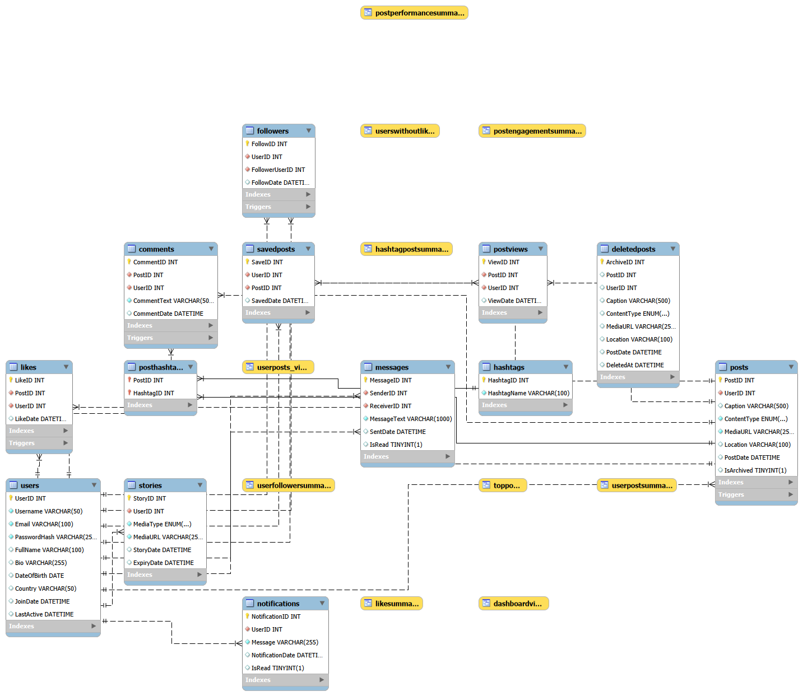
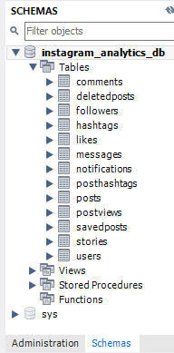
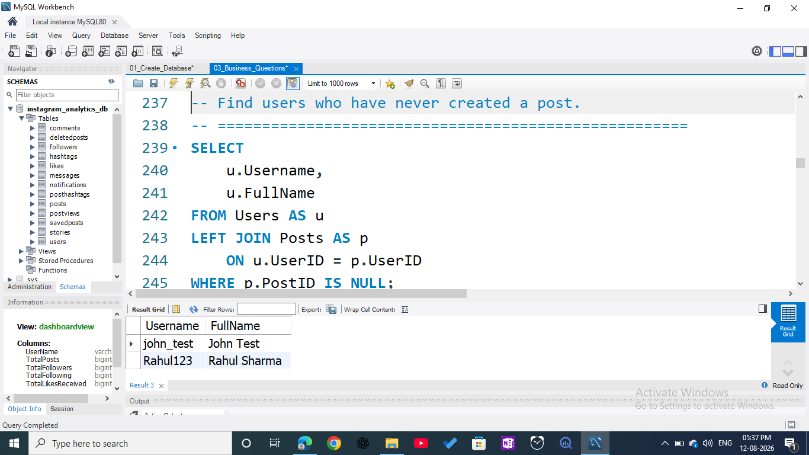
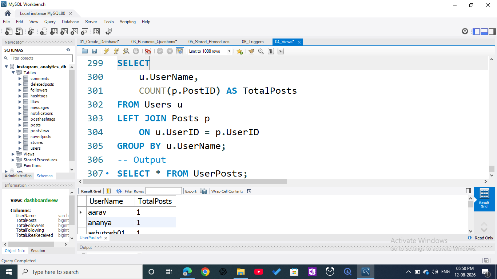

# 📸 Instagram SQL Analytics Project

A complete **Instagram-style Social Media Analytics Database Project** built using **MySQL** to demonstrate **database design, normalization, advanced SQL programming, query optimization, and business analytics reporting**.

---

## 🚀 Features

* Relational database design
* Primary & Foreign Keys
* Normalized schema
* Business analytics queries
* Views
* Stored Procedures
* Triggers
* Transactions
* Indexing for performance optimization

---

## 🛠️ Technologies Used

* **MySQL 8.0**
* **MySQL Workbench**
* **SQL**

---

## 📌 Project Highlights

* Designed a **normalized Instagram-style relational database schema**.
* Implemented **Primary Keys, Foreign Keys, and relationship constraints**.
* Developed **Views, Stored Procedures, Triggers, Transactions, and Indexes** for automation and performance optimization.
* Solved **business analytics problems** related to **user engagement, content performance, follower growth, and hashtag trends**.

---

## 📂 Project Structure

```text
Instagram-SQL-Analytics-Project/
│
├── sql/
│   ├── 01_Create_Database.sql
│   ├── 02_Insert_Data.sql
│   ├── 03_Business_Questions.sql
│   ├── 04_Views.sql
│   ├── 05_Stored_Procedures.sql
│   ├── 06_Triggers.sql
│   ├── 07_Indexes.sql
│   └── 08_Transactions.sql
│
├── screenshots/
│   ├── tables.png
│   ├── queries.png
│   └── output.png
│
├── ER_Diagram.png
└── README.md
```

---

## 🗄️ Database Tables

The project contains the following tables:

1. **Users**
2. **Posts**
3. **Comments**
4. **Likes**
5. **Followers**
6. **Stories**
7. **Messages**
8. **SavedPosts**
9. **PostViews**
10. **Hashtags**
11. **PostHashtags**

---

## 📊 Business Queries Implemented

The project includes **32 SQL business analytics queries**, such as:

* Top users by followers
* Most liked posts
* Most commented posts
* User engagement analysis
* Trending hashtags
* Active users
* Story analytics
* Post performance metrics
* Message activity statistics

---

## 🧠 Advanced SQL Concepts

### Views

* User Post Summary
* Top Posts
* Hashtag Analytics
* Dashboard Metrics

### Stored Procedures

* Add New User
* Add New Post
* Like Post
* User Analytics
* Post Analytics

### Triggers

* Update user last active
* Prevent self-follow
* Generate notifications
* Maintain audit consistency

### Transactions

* Create post with hashtags
* Safe deletion
* Ownership transfer
* Archive operations
* Follow + notification handling

### Indexes

* `Posts(UserID)`
* `Likes(PostID)`
* `Comments(PostID)`
* `Followers(UserID)`
* `Messages(SenderID)`
* `PostHashtags(HashtagID)`
* `Users(UserName)`

---

## ▶️ How to Run

Execute the SQL scripts in the following order:

```sql
01_Create_Database.sql
02_Insert_Data.sql
03_Business_Questions.sql
04_Views.sql
05_Stored_Procedures.sql
06_Triggers.sql
07_Indexes.sql
08_Transactions.sql
```

---

## 📷 Screenshots

### ER Diagram

```markdown

```

### Database Tables

```markdown

```

### Business Query Example

```markdown

```

### Advanced SQL Output

```markdown

```

---

## 📚 SQL Concepts Used

* SELECT
* WHERE
* ORDER BY
* GROUP BY
* HAVING
* Aggregate Functions
* INNER JOIN
* LEFT JOIN
* Subqueries
* Views
* Stored Procedures
* Triggers
* Transactions
* Indexes
* Constraints
* Foreign Keys

---

## 🎯 Learning Outcomes

Through this project I practiced:

* Database Design & Normalization
* Relational Modeling
* Complex SQL Query Writing
* Business Analytics with SQL
* Query Optimization
* Data Integrity Management
* Stored Procedures & Trigger Development
* Transaction & Rollback Handling

---

## 👩‍💻 Author

**Mahak Chauhan**

* 🔗 **GitHub:** https://github.com/mahakchauhan005-bit

---

⭐ If you found this project useful, consider giving it a **star on GitHub!**
